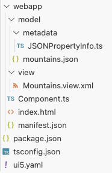

[](webapp)
# Exercise 0: Setup the Project on Your Machine

This exercise will guide you through the process of setting up a development environment on your computer. You will install Node.js, download and extract a zip file for a project, install project dependencies using npm, and serve the project using the UI5 tooling.

## Step 1: Install Node.js

If it is not alreaday available, the first step is to download and install it from https://nodejs.org/.

You can confirm the installation by opening your terminal or command prompt and typing:

```bash
node -v
```

This command should display the installed version of Node.js.

## Step 2: Download and Extract Project Files

Next, we will download the project files contained in a .zip file. 

- Download the project files from [mdc.tutorial.zip](../../../raw/main/ex0/mdc.tutorial.zip).
- Once the download is complete, navigate to the download location and extract the .zip file. 

## Step 3: Open the Project Folder

Now, we will open the project folder in your code editor.

- Navigate to the extracted project folder.
- Open the folder in your preferred code editor.

The structure should look like this: 



## Step 4: Install Project Dependencies

Once the project is open in your code editor, we will install the project dependencies using npm, the Node Package Manager, which was installed alongside Node.js.

- Open a terminal or command prompt in your project's root directory. 
- Run the following command:

```bash
npm install
```

This command will read the `package.json` file in your project and install the necessary dependencies.

## Step 5: Serve the Project

Finally, we will serve the project using ui5.

- In the terminal or command prompt at your project's root directory, run the following command:

```bash
ui5 serve
```

This command will start a development server for your project. Open the browser and check out the running application! 🚀


## Summary
Congratulations, you have successfully set up your development environment and served your project!

Continue to - [Exercise 1](../ex1/readme.md)