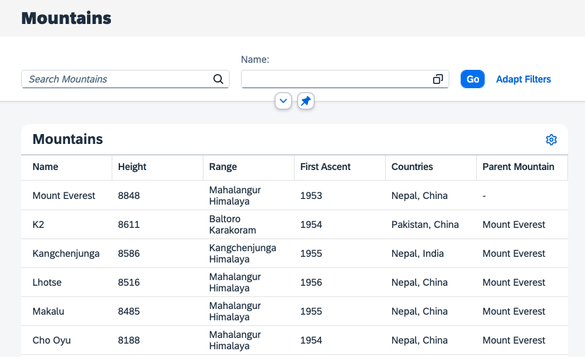

[](webapp)
[](https://sap-samples.github.io/ui5-mdc-json-tutorial/ex2/dist)
# Exercise 2: How to Use the MDC FilterBar
In this exercise, we will create a FilterBarDelegate, add a FilterBar to the XML view, use the filter association of the table and implement the search feature as a combination of filters.
## Step 1: Create a FilterBarDelegate
This delegate is responsible for managing the filtering logic for an application. This includes creating and managing FilterFields, as well as providing the corresponding PropertyInfo for FilterFields.
###### delegate/JSONFilterBarDelegate.ts
```typescript
import FilterBarDelegate from "sap/ui/mdc/FilterBarDelegate"
import JSONPropertyInfo from "mdc/tutorial/model/metadata/JSONPropertyInfo"
import FilterField from "sap/ui/mdc/FilterField"
import Element from "sap/ui/core/Element"
import {default as FilterBar, PropertyInfo as FilterBarPropertyInfo} from "sap/ui/mdc/FilterBar"

var JSONFilterBarDelegate = Object.assign({}, FilterBarDelegate)

JSONFilterBarDelegate.fetchProperties = async () => JSONPropertyInfo

const _createFilterField = (id:string, property:FilterBarPropertyInfo, filterBar:FilterBar) => {
	const propertyKey = property.key
	const filterField = new FilterField(id, {
		dataType: property.dataType,
		conditions: `{$filters>/conditions/${propertyKey}}`,
		propertyKey: propertyKey,
		required: property.required,
		label: property.label,
		maxConditions: property.maxConditions,
		delegate: {name: "sap/ui/mdc/field/FieldBaseDelegate", payload: {}}
	})
	return filterField
}

JSONFilterBarDelegate.addItem = async (filterBar:FilterBar, propertyKey:string) => {
	const property = JSONPropertyInfo.find((p) => p.key === propertyKey) as FilterBarPropertyInfo
	const id = `${filterBar.getId()}--filter--${propertyKey}`
	const filterField = Element.getElementById(id) as FilterField
	return filterField ?? _createFilterField(id, property, filterBar)
}

export default JSONFilterBarDelegate
```

## Step 2: Use the MDC FilterBar
To add a FilterBar to the XML view, we can use the [`sap.ui.mdc.FilterBar`](https://sdk.openui5.org/api/sap.ui.mdc.FilterBar) control. Setting the previously created delegate makes sure, that the FilterBar can deal with the specific JSON data we are facing. Place the FilterBar inside of the DynamicPageHeader.
###### view/Mountains.view.xml
```xml
				<mdc:FilterBar id="filterbar" delegate="{name: 'mdc/tutorial/delegate/JSONFilterBarDelegate'}"
						p13nMode = "Item,Value">
					<mdc:basicSearchField>
						<mdc:FilterField delegate="{name: 'sap/ui/mdc/field/FieldBaseDelegate'}"
							dataType="sap.ui.model.type.String"
							placeholder= "Search Mountains"
							conditions="{$filters>/conditions/$search}"
							maxConditions="1"/>
					</mdc:basicSearchField>
					<mdc:filterItems>
						<mdc:FilterField
							label="Name"
							propertyKey="name"
							dataType="sap.ui.model.type.String"
							conditions="{$filters>/conditions/name}"
							delegate="{name: 'sap/ui/mdc/field/FieldBaseDelegate'}"/>
					</mdc:filterItems>
					<mdc:dependents>

					</mdc:dependents>
				</mdc:FilterBar>
```

>⚠️ Like columns in the MDC table, the filter items are used for UI adaptation functionalities. Hence, do not change them, manually or dynamically, or use bindings to prevent undesired effects.

Use the filter association of the table to connect it to the FilterBar and add the fields we would like to search in the payload. For this, add the `searchKeys` property to the delegate payload.
###### view/Mountains.view.xml
```xml
			<mdc:Table
				id="table"
				header="Mountains"
				p13nMode="Sort,Column"
				type="ResponsiveTable"
				threshold="100"
				filter="filterbar"
				showRowCount="false"
				delegate="{
					name: 'mdc/tutorial/delegate/JSONTableDelegate',
					payload: {
						bindingPath: 'mountains>/mountains',
						searchKeys: ['name', 'range', 'parent_mountain', 'countries']
					}
				}">
```

## Step 3: Enable the Search in the JSONTableDelegate
To implement the search feature, we need to extend the `JSONTableDelegate` and override the `getFilters` method. We implement a simple search feature by combining several filters and appending them to the regular filter set, which is prepared by the `TableDelegate`. Furthermore, we will extend the interface of the `TablePayload`, which then should also contain the information about the `searchKeys`. At this point, you might need to add missing imports for `Filter`, `FilterOperator`, and `FilterBar`, which you can either do manually or use the "Quick Fix" feature of e.g. Visual Studio Code.

###### delegate/JSONTableDelegate.ts
```typescript
interface TablePayload {
	bindingPath: string
	searchKeys: string[]
}

const _createSearchFilters = (search:string, keys:string[]) => {
	const filters = keys.map((key) => new Filter({
		path: key,
		operator: FilterOperator.Contains,
		value1: search
	}))
	return [new Filter(filters, false)]
}

JSONTableDelegate.getFilters = (table) => {
	const search = (Element.getElementById(table.getFilter()) as FilterBar).getSearch()
	const keys = (table.getPayload() as TablePayload).searchKeys
	let filters = TableDelegate.getFilters(table)
	if (search && keys) {
		filters = filters.concat(_createSearchFilters(search, keys))
	}
	return filters
}
```
Now go and try out the filter and search functionality in our application. The table should display only the filtered items! 🙌



## Summary
In this exercise, we have extended the functionality of our application by adding a FilterBarDelegate to handle filtering operations, and a JSONTableDelegate to handle search operations. We have also learned how to use the filter association of the table to connect the FilterBar to the Table. This allows us to create a more interactive and dynamic user interface, where the user can filter and search the data in the table based on their needs.

Continue to - [Exercise 3](../ex3/readme.md)